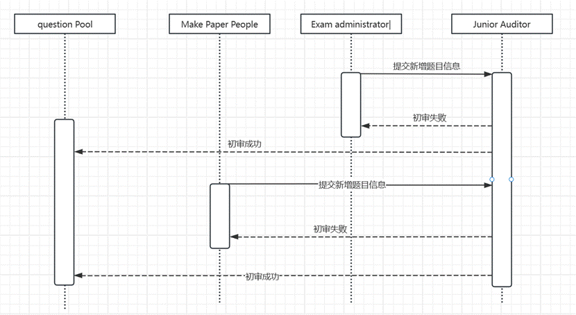

## 在线考试系统分析与设计成果报告

> 代码GitHub地址：
>
> + 前端：https://github.com/hahahapluto/ExamProWeb
>
> + 后端：https://github.com/tiffany886/ExamPro

组  长：zhh

其它组员：psm

**主要工作：**

组员1： 前端、后端开发及报告的编写

组员2： 前端、后端开发及报告的编写

#### 1选题

###### 1.1 选题名称

ExamPro在线考试系统

###### 2.1 选题描述         

在线考试系统是一个基于网络的教育工具，旨在提供灵活、高效的考试和评估解决方案。该系统将为学校、培训机构、招聘公司和其他组织提供一个全面的在线考试平台。系统的主要功能包括用户管理、题库管理、试卷生成、考试管理、学生报名和参加考试、监考处理、评卷与成绩管理等。考试管理员可以根据其需求创建不同类型的考试，包括选择题、填空题、主观题等。学生可以在规定时间内报名参加考试，系统将自动批改客观题，评卷人可以登录本平台批改学生的主观题。系统还支持不同角色，如出卷人、审核员、考试管理员、监考人和评卷人，以确保考试的公平性和合规性。在线考试系统的目标是提供一个便捷的方式来进行考试和评估，减少纸质考卷的使用，提高考试效率，降低成本，并加强考试数据的安全性和可管理性。

#### 2用户需求

###### 2.1 功能需求

分模块阐述系统功能细节

(1) 用户管理模块

①  注册：允许用户创建新的帐户。用户需要提供必要的注册信息，如用户名、密码、角色。系统应验证信息的有效性，并为新用户创建一个帐户。用户名不可重复。

②  登录：允许已注册用户使用其用户名和密码登录系统。系统应验证用户的凭据，然后允许他们访问系统的其他功能。

③  用户权限管理： 管理已注册用户的权限和角色。这可以包括分配用户不同的角色（例如，初级审核员、终极审核员、考试管理员、考生、出卷人和监考人等），并根据其角色来限制或授权其访问系统的不同功能。

(2) 题库管理模块

①  题库添加：允许考试管理员或出卷人创建新的题库。

②  添加题目：允许考试管理员或出卷人创建新的题目。讲题目加到题库中去。用户应该能够输入问题、答案、分数和题目类型，并将问题与特定题库相关联。

(3) 试卷管理模块

①  试卷查询：考试管理员可以查询试卷。

②  试卷创建：出卷人可以新增试卷，并在试卷中新增对应的题目。

③  试卷总分计算：当出卷人添加完毕试题后，总分会自动计算。

(4) 考试管理模块

①  考试查询：考生可以查询考试。

②  创建考试：考试管理员可以创建考试，并选择对应考试的卷子。

③  考试报名：考生可以报名已发布且通过审核的考试。

④  考生考试：在考试时间开始后，考生可以进入考试进行答题，答题后不可修改答案，且考试结束不可再次进入查看试卷。

⑤  考试管理员评卷：考生答题完毕或考生交卷后即可看到考生答题情况，并进行评卷，系统会自动结算总分。

⑥  监考人监考：监考人需要监控考生，并及时解决考生的一些问题。

(5) 审核模块

①  题目上传后要进行初审，通过方可给用户查询。

②  题库添加题目后要进行终审，才能加进题库中，出卷人出卷选择题库列表时才能查询到。

③  试卷和考试都要经过初审和终审两层审核后，才能给对应角色的用户查询。

###### 2.2 用例模型

**系统描述：** 

这个系统是一个多角色的在线考试管理系统，旨在高效地组织和管理在线考试，确保考试的公平性和成绩的准确性。系统包括不同用户角色，包括出卷人、监考人、考试管理员、初级审核员、终极审核员和考生。每个角色都有特定的职责和权限，以满足其在在线考试流程中的需求。

**核心目标：** 

系统的核心目标在于提供一个便捷的方式来组织和管理在线考试，以确保考试的公平性，并保证对考卷的评分准确无误。通过这个系统，考生能够轻松报名和参加考试，考试管理员和出卷人可以上传相关题目，出卷人可以从题目池和题库中构建试卷，监考人可以严格监督考试的进行，而考试管理员则负责全面管理整个考试流程，包括评分和成绩管理的后续工作。同时，审核员的参与确保了题目、题库和考卷的质量，从而提高了考试的标准和可靠性。

**用户角色和关键功能：**

1. 出卷人：上传题目，构建考卷
2. 监考人：监考考试，确保考试规则遵守
3. 考试管理员：上传题目，创建考试，负责评分和成绩管理
4. 初级审核员：审核上传的题目和考试
5. 终极审核员：审核题库、考卷，以及二审考试
6. 考生：查看题目，报名和参加考试

2.2.1 用例图

要求与功能需求一致


2.2.2 用例描述

详细阐述每个参与者和用例的细节

目标：在线考试管理系统的主要目标是提供一个多角色的平台，用于方便地组织和管理在线考试，确保考试的公平性、安全性，并提供准确的评分。

（一）参与者：审核员、考试管理员、考生、出卷人、监考人

（二）用例列表：

1. 考试管理员（Exam Administrator）用例列表：

(1) 注册和登录

①  目标：考试管理员可以注册新账户并登录系统。

②  主要步骤：考试管理员提供必要的信息进行注册，然后使用其凭证登录系统。

(2) 发布考试

①  目标：考试管理员可以创建考试。

②  主要步骤：考试管理员可以设置考试的开始和结束日期，允许学生报名，选择已审核的考卷分配考卷，然后发布考试。

(3) 分配监考人和评卷人

①  目标：考试管理员可以分配监考人，确保考试的监督。

②  主要步骤：考试管理员选择适当的监考人，分配任务。

(4) 查看考试结果和成绩

①  目标：考试管理员可以查看考试的结果和成绩，包括学生的得分和可能的争议情况。

②  主要步骤：考试管理员可以查看考试结果，解决争议情况，并修改成绩（如果需要）。

2. 考生（Examinee）用例列表：

(1) 注册和登录

①  目标：学生可以注册新账户并登录系统。

②  主要步骤：学生提供必要的信息进行注册，然后使用其凭证登录系统。

(2) 查看可用的考试

①  目标：学生可以查看可报名的考试。

②  主要步骤：学生浏览可报名的考试列表，并选择感兴趣的考试。

(3) 报名参加考试

①  目标：学生可以报名参加考试。

②  主要步骤：学生选择想要参加的考试，进行报名。

(4) 回答考卷中的题目

①  目标：学生可以回答考卷中的题目，完成考试。

②  主要步骤：学生打开所选考卷，回答其中的题目。

(5) 查看考试成绩和反馈

①  目标：学生可以查看考试成绩和获得反馈。

②  主要步骤：学生查看已完成考卷的成绩，获取可能的反馈信息。

(6) 发起投诉

①  目标：学生可以发起投诉，解决考试中的问题或争议。

②  主要步骤：学生提交投诉，并等待处理。

3. 初级审核员（Primary Auditor）用例列表：

(1) 注册和登录

①  目标：初级审核员可以注册新账户并登录系统。

②  主要步骤：初级审核员提供必要的信息进行注册，然后使用其凭证登录系统。

(2) 审核学生上传的考题

①  目标：初级审核员可以审核学生上传的考题，决定是否将其加入题目池。

②  主要步骤：初级审核员查看学生上传的考题，对其进行审核，可以选择通过或拒绝加入题目池。

(3) 一级审核考卷

①  目标：初级审核员可以一审出卷人构建的考卷，确保质量和准确性。

②  主要步骤：初级审核员查看考卷内容，对其进行审核，确保题目合适且符合标准。

(4) 一级审核考试

①  目标：初级审核员一审考试管理员创建的考试，确保质量和规则得到遵守。

②  主要步骤：初级审核员查看考试设置，确保规则和要求得到满足。

4. 终极审核员（Ultimate Auditor）用例列表：

(1) 注册和登录

①  目标：终极审核员可以注册新账户并登录系统。

②  主要步骤：终极审核员提供必要的信息进行注册，然后使用其凭证登录系统。

(2) 审核题库

①  目标：终极审核员可以审核考试管理员和出卷人创建的题库，决定是否批准其使用。

②  主要步骤：终极审核员查看题库内容，对其进行审核，可以选择批准或拒绝使用。

(3) 二级审核考卷

①  目标：终极审核员可以二审出卷人构建的考卷，确保质量和准确性。

②  主要步骤：终极审核员查看考卷内容，对其进行审核，确保题目合适且符合标准。

(4) 二级审核考试

①  目标：终极审核员可以二审考试管理员创建的考试，确保质量和规则得到遵守。

②  主要步骤：终极审核员查看考试设置，确保规则和要求得到满足。

5. 出卷人（Question Setter）用例列表：

(1) 注册和登录

①  目标：出卷人可以注册新账户并登录系统。

②  主要步骤：出卷人提供必要的信息进行注册，然后使用其凭证登录系统。

(2) 上传题目

①  目标：出卷人可以上传新的题目，添加到题目池中。

②  主要步骤：出卷人输入问题、答案、分数和题目类型，然后将题目添加到题目池。

(3) 构建考卷

①  目标：出卷人可以从题目池和题库中构建考卷。

②  主要步骤：出卷人选择适当的题目，构建考卷，并指定总分

6. 监考人（Proctor）用例列表：

(1) 注册和登录

①  目标：监考人可以注册新账户并登录系统。

②  主要步骤：监考人提供必要的信息进行注册，然后使用其凭证登录系统。

(2) 监考考试

①  目标：监考人可以监考进行中的考试，确保考试规则得到严格遵守。

②  主要步骤：监考人出席考试场地，监督学生，确保规则得到遵守。

2.2.3多角色交互业务流程活动图

（1）题目管理：**考试管理员**或出卷人可以上传题目->**初级审核员**审核通过加进题目池->**考试管理员**或出卷人选择题目加入题库->**终极审核员**审核题库


（2）试卷管理：**出卷人**出卷->**初级审核员**审核->**终极审核员**审核


（3）考试安排和报名：**考试管理员**新增考试并选择卷子->**初级审核员**审核->**终极审核员**审核->**考生**可以报名考试


（4）考试及评分管理：**考生**可以做卷子->**监考人**监考处理考试中问题和规则->考试结束**考试管理员**可以评卷->**考试管理员**可以查看考生成绩且可以修改有争议的成绩


#### 3数据库设计

###### 3.1 概念结构设计（E-R图）

1. 考试可以报名考试，监考人对考试进行监考，考生答题，由评卷人对考生所做的卷子进行评卷。


2. 考试管理员和出卷人可以出题，由初级审核员对题目进行审核，同时可以新增题库，讲题目添加到题库中，由终极审核员对题库进行审核。


3. 考试管理员可以创建考试，由初级审核员和终极审核员对考试进行审核，通过后学生才可以报名考试。


4. 出卷人可以新建卷子，在题目池或者题库中选择题目组成卷子，由初级审核员和终极审核员对考试进行审核，通过后考试管理员才可以在考试中选择该卷子。

 


###### 3.2 逻辑结构设计（关系模式）

题库题目关联表 : BankQuestion (LinkID, BankID, QuestionID,ultimateState)

考试表 : Exam (ExamID, ExamName, ExamDescription, PaperID, StartTime, EndTime, ExamDuration, NumberOfExaminees, UserID,ultimateState,juniorState)

考试监考人表 : exam_proctor(RecordID, ProctorID, examID)

考试记录表 : ExamRecord (RecordID, PaperID, QuestionID, StudentAnswer, Score, TotalScore, ExamID, UserID)

考试报名表 : ExamRegistration (RegistrationID, ExamID, UserID)

评卷管理表 : gradingmanagement(GradingID, PaperID, ExamineeID, GraderID, StartTime, EndTime, ObjectiveScore, SubjectiveScore, TotalScore)

试卷管理表 : PaperManagement (PaperID, PaperName, ObjectiveScore, TotalScore, SubjectiveScore, UserID,ultimateState,juniorState)

试卷题目关联表 : PaperQuestion (LinkID, PaperID, QuestionID, QuestionType, Score, Order

监考记录表:proctoring_record(RecordID,ExamineeID,ExamID,ProctorID,IssueContent,Time,

SenderID)

题库表 : QuestionBank (BankID, BankName, CreateTime, UserID)

题目池表 : QuestionPool (QuestionID, QuestionType, QuestionDescription, UserID, QuestionAnswer, CreateTime, QuestionScore, juniorState)

角色表：Role(RoleID, RoleName)

用户表 : User (UserID, Username, Password, Role)

考试记录表：userExamScore(id, userID,examID,totalScore)

###### 3.3 数据库实现SQL代码

```
DROP DATABASE IF EXISTS exam_pro;
CREATE DATABASE exam_pro;
use exam_pro;

SET NAMES utf8mb4;
SET FOREIGN_KEY_CHECKS = 0;
```

3.3.1 bankquestion：题库题目关联表

```
-- auto-generated definition
create table bankquestion
(
    LinkID        int auto_increment comment '关联ID'
        primary key,
    BankID        int           not null comment '题库ID',
    QuestionID    int           not null comment '题目ID',
    ultimateState int default 0 not null comment '终极审核状态',
    constraint bankquestion_ibfk_1
        foreign key (BankID) references questionbank (BankID),
    constraint bankquestion_ibfk_2
        foreign key (QuestionID) references questionpool (QuestionID)
)
    comment '题库题目关联表';

create index BankID
    on bankquestion (BankID);

create index QuestionID
    on bankquestion (QuestionID);
```

3.3.2 Exam 考试表

```
-- auto-generated definition
create table exam
(
    ExamID            int auto_increment comment '考试ID'
        primary key,
    ExamName          varchar(255)  not null comment '考试名称',
    ExamDescription   varchar(255)  not null comment '考试描述',
    PaperID           int           not null comment '试卷ID',
    StartTime         datetime      not null comment '考试开始时间',
    EndTime           datetime      not null comment '考试结束时间',
    ExamDuration      int           not null comment '考试时长（分钟）',
    NumberOfExaminees int default 0 not null comment '考试人数',
    UserID            int           not null comment '创建人ID',
    ultimateState     int default 0 not null comment '终极审核状态',
    juniorState       int default 0 not null comment '初级审核状态',
    constraint exam_ibfk_1
        foreign key (PaperID) references papermanagement (PaperID),
    constraint fk_user
        foreign key (UserID) references user (UserID)
)
    comment '考试表';

create index PaperID
    on exam (PaperID);
```

 

3.3.3 exam_peoctor 考试监考人表

```
-- auto-generated definition
create table exam_proctor
(
    RecordID  int auto_increment comment '记录ID'
        primary key,
    ProctorID int not null comment '监考人ID',
    examID    int not null comment '考试ID',
    constraint exam_proctor_ibfk_1
        foreign key (ProctorID) references user (UserID),
    constraint exam_proctor_ibfk_2
        foreign key (examID) references exam (ExamID)
)
    comment '考试监考人表';

create index ProctorID
    on exam_proctor (ProctorID);

create index examID
    on exam_proctor (examID);
```

3.3.4 examrecord 考试记录表

```
-- auto-generated definition
create table examrecord
(
    RecordID      int auto_increment comment '考试记录ID'
        primary key,
    PaperID       int  not null comment '试卷ID',
    QuestionID    int  not null comment '题目ID',
    StudentAnswer text null comment '学生答案',
    Score         int  null comment '所得分数',
    TotalScore    int  null comment '题目总分',
    ExamID        int  not null comment '考试ID',
    UserID        int  not null comment '用户ID',
    constraint examrecord_ibfk_1
        foreign key (PaperID) references papermanagement (PaperID),
    constraint examrecord_ibfk_2
        foreign key (QuestionID) references questionpool (QuestionID),
    constraint examrecord_ibfk_3
        foreign key (ExamID) references exam (ExamID),
    constraint examrecord_ibfk_4
        foreign key (UserID) references user (UserID)
)
    comment '考试记录表';

create index PaperID
    on examrecord (PaperID);

create index QuestionID
    on examrecord (QuestionID);
```

3.3.5 examregistration 考试报名表

```
-- auto-generated definition
create table examregistration
(
    RegistrationID int auto_increment comment '报名ID'
        primary key,
    ExamID         int not null comment '考试ID',
    UserID         int not null comment '用户ID',
    constraint examregistration_ibfk_1
        foreign key (ExamID) references exam (ExamID),
    constraint examregistration_ibfk_2
        foreign key (UserID) references user (UserID)
)
    comment '考试报名表';

create index ExamID
    on examregistration (ExamID);

create index UserID
    on examregistration (UserID);
```

3.3.6 gradingmanagement 评卷管理表

```
-- auto-generated definition
create table gradingmanagement
(
    GradingID       int auto_increment comment '评卷ID'
        primary key,
    PaperID         int      not null comment '试卷ID',
    ExamineeID      int      not null comment '考生ID',
    GraderID        int      not null comment '创建人ID',
    StartTime       datetime not null comment '开始评卷时间',
    EndTime         datetime not null comment '结束评卷时间',
    ObjectiveScore  int      not null comment '客观题分数',
    SubjectiveScore int      not null comment '主观题分数',
    TotalScore      int      not null comment '总分',
    constraint gradingmanagement_ibfk_1
        foreign key (PaperID) references papermanagement (PaperID),
    constraint gradingmanagement_ibfk_2
        foreign key (ExamineeID) references user (UserID),
    constraint gradingmanagement_ibfk_3
        foreign key (GraderID) references user (UserID)
)
    comment '评卷管理表';

create index ExamineeID
    on gradingmanagement (ExamineeID);

create index GraderID
    on gradingmanagement (GraderID);

create index PaperID
    on gradingmanagement (PaperID);
```

3.3.7 papermanagerment 试卷管理员

```
-- auto-generated definition
create table papermanagement
(
    PaperID         int auto_increment comment '试卷ID'
        primary key,
    PaperName       varchar(255)  not null comment '试卷名称',
    ObjectiveScore  int           not null comment '客观题分数',
    TotalScore      int           not null comment '总分',
    SubjectiveScore int           not null comment '主观题分数',
    UserID          int           not null comment '创建人ID',
    ultimateState   int default 0 not null comment '终极审核状态',
    juniorState     int default 0 not null comment '初级审核状态',
    constraint papermanagement_ibfk_1
        foreign key (UserID) references user (UserID)
)
    comment '试卷管理表';

create index UserID
    on papermanagement (UserID);
```

3.3.8 paperquestion 试卷题目关联表

```
-- auto-generated definition
create table paperquestion
(
    LinkID       int auto_increment comment '关联ID'
        primary key,
    PaperID      int          not null comment '试卷ID',
    QuestionID   int          not null comment '题目ID',
    QuestionType varchar(255) not null comment '题目类型',
    Score        int          not null comment '题目分数',
    constraint paperquestion_ibfk_1
        foreign key (PaperID) references papermanagement (PaperID)
)
    comment '试卷题目关联表';

create index PaperID
    on paperquestion (PaperID);
```

3.3.9 proctoring_record 监考记录表

```
-- auto-generated definition
create table proctoring_record
(
    RecordID     int auto_increment comment '记录ID'
        primary key,
    ExamineeID   int                                 not null comment '考生ID',
    ExamID       int                                 not null comment '考试ID',
    ProctorID    int                                 not null comment '监考人ID',
    IssueContent varchar(255)                        not null comment '问题内容',
    Time         timestamp default CURRENT_TIMESTAMP null,
    SenderID     int                                 not null comment '发送人ID',
    constraint proctoring_record_ibfk_1
        foreign key (ProctorID) references exam_proctor (ProctorID)
)
    comment '监考记录表';

create index ProctorID
    on proctoring_record (ProctorID);
```

3.3.10 questionbank 题库管理表

```
-- auto-generated definition
create table questionbank
(
    BankID     int auto_increment comment '题库ID'
        primary key,
    BankName   varchar(255)                        not null comment '题库名称',
    createTime timestamp default CURRENT_TIMESTAMP null,
    UserID     int                                 not null comment '题库所属用户ID',
    constraint questionbank_ibfk_1
        foreign key (UserID) references user (UserID)
)
    comment '题库管理表';

create index UserID
    on questionbank (UserID);
```

3.3.11 questionpool 题目池表

```
-- auto-generated definition
create table questionpool
(
    QuestionID          int auto_increment comment '题目ID'
        primary key,
    QuestionType        varchar(255)                        not null comment '题目类型',
    QuestionDescription text                                null comment '题目描述',
    UserID              int                                 not null comment '所属用户ID',
    QuestionAnswer      text                                null comment '题目答案',
    createTime          timestamp default CURRENT_TIMESTAMP null,
    questionScore       int                                 not null comment '题目分数',
    juniorState         int       default 0                 not null comment '初级审核状态',
    constraint questionpool_ibfk_1
        foreign key (UserID) references user (UserID)
)
    comment '题目池表';

create index UserID
    on questionpool (UserID);
```

3.3.12 role 角色表

```
-- auto-generated definition
create table role
(
    RoleID   int auto_increment comment '角色ID'
        primary key,
    RoleName varchar(255) not null comment '角色名称'
)
    comment '角色表';
```

3.3.13 user 用户表

```
-- auto-generated definition
create table user
(
    UserID   int auto_increment comment '用户ID'
        primary key,
    Username varchar(255) not null comment '用户名',
    Password varchar(255) not null comment '密码',
    RoleID   int          not null comment '角色ID',
    constraint fk_role
        foreign key (RoleID) references role (RoleID)
)
    comment '用户表';
```

 

#### 4类设计

###### 4.1 主要系统类、功能及分类

根据用例模型的要求，系统将需要设计很多类实现用例的功能。基于MVC模式的划分通常涉及将一个应用程序的不同组件分成三个主要部分：模型（Model）、视图（View）和控制器（Controller）。

4.1.1 模型层类（Model）

模型层负责处理应用程序的数据和业务逻辑。这包括应用程序的核心数据结构、数据库交互、数据验证、数据操作等。模型类通常独立于用户界面，它们存储和管理应用程序的数据。模型层类包括各种数据模型和服务，用于处理数据的创建、读取、更新和删除等操作。

永久层主要包括ExamDao, ExamInfoDao, ExamrecordDao, ExamUserInfoDao, BankquestionDao，Papermanagement, PaperQuestoinItemDao，PaperQuestionDao， PaperBankDao，QuestionPoolDao等。

业务层主要包括ExamMapper, ExamRecordMapper, ExamRegistrationMapper, PaperManagementMapper,PaperQuestionMapper,QuesAddBankMapper, QuestionBankMapper, QuestionPoolMapper等。

4.1.2 控制层类

控制层类负责协调模型层和视图层之间的交互。它接受用户输入，并根据这些输入调用适当的模型层操作来处理数据。控制层还可以处理业务逻辑，例如验证用户权限、决定数据流向等。在MVC模式中，这通常是控制器（Controller）的任务。

主要包括AduitController, ExamController,BankController, PaperController, QuesAddBankController, QuestionController, UserController, UserInfoController等。这些类的职责是接受View层的请求，与模型层交互完成业务功能后，再将处理结果反馈给View层。

4.1.3 视图类

视图层类负责用户界面的展示和用户交互。它呈现数据给用户，并接受用户的输入。视图通常是用户界面元素，如窗口、表单、按钮等。视图类不处理业务逻辑或数据操作，而是依赖控制层来处理这些任务。

主要包括addBank.vue, addQues.vue, examReg.vue, examPaper.vue, examRegistration.vue,myExam.vue,myExamRecord.vue,popUp.vue,settingPages.vue, giveScore.vue, markPaper.vue, registUser.vue, addQuesInBank.vue, examItem.vue, addTopicPop.vue,multipleChoice.vue,multipleShow.vue,quesSequence.vue,subQuestions.vue,subShowQues.vue,createPaper.vue,exam.vue,paper.vue,quesBank.vue, question.vue,teaTopicPool.vue,topicCard.vue,topicPool.vue,index.vue,login.vue,App.vue等组件。

###### 4.2 类图

控制器类（如UserController）通常放在控制器包或目录中，用于处理HTTP请求和响应。

业务层的接口（UserService）和实现类（UserServiceImpl）通常放在业务层的包或目录中，用于处理与用户相关的业务逻辑。

数据访问接口（UserMapper）通常放在数据访问层的包或目录中，用于执行数据库操作。

用户模块：控制层接收用户请求，例如查找用户、登录、注册以及更新用户信息，然后调用业务层执行核心逻辑，包括用户的查找、创建、信息更新等操作，业务层可能会涉及数据访问接口层以与数据存储进行交互，执行数据库操作，最终控制层将结果反馈给用户。


试题模块：控制层接收用户请求，例如搜索题目、添加题目、查询审核状态等，随后调用业务层完成核心逻辑，包括题目的创建、搜索、审核状态的查询，而业务层借助数据访问接口层与数据存储进行交互，执行数据库操作，最后，控制层将结果返回给用户。


考卷模块：控制层接收用户请求，如搜索试卷、添加试卷、查找试卷题目等，随后调用业务层完成核心逻辑，包括创建试卷、题目的增加等操作，而业务层访问接口层与数据存储进行交互，执行数据库操作，最后，控制层将结果返回给用户。


考试模块：控制层接收用户请求，涵盖了获取所有考试、用户考试记录、注册用户参加考试以及更新考试信息等多方面操作，业务层执行逻辑，包括考试的通过状态、用户考试记录等。业务层涉及数据访问接口层的调用，执行数据库操作，最后，控制层将结果返回给用户。


评卷模块：用户通过控制层发起审核请求，控制层解析请求并将其传递给业务层，业务层执行审核逻辑，包括条件检查和状态更新，调用数据访问接口以反映更改在数据存储中。最后，控制层将响应结果返回给用户，通知他们审核操作的结果。审核包括了题目，试卷，考试和题库的审核。


#### 5业务流程顺序图

###### 5.1 注册用例


###### 5.2 新增题目用例



###### 5.3 创建题库用例


###### 5.4 新建考卷用例


 

###### 5.5 新增考试用例


###### 5.5 考试报名及考试用例


###### 5.6 评卷人评卷用例


#### 6系统各模块运行界面截图

###### 6.1 登录和注册

6.1.1 注册用户并选择用户角色


6.1.2 登录注册成功的用户，输入用户名和密码即可登录


###### 6.2 考卷管理模块

6.2.1 题目池

1. 用户可以查看通过审核的试题。


 

2. 可以把通过审核的试题加入到自己的创建的题库中。


6.2.2 题库管理

**1.** **新增题库**

****

 

6.3.3 试题管理

**1.** **新增题目（单选题）**

****

**3.**     **新增题目（多选题）**

****

**4.**     **新增题目（简答题）**

****

**5.**     **选择题目添加到题库，可以进行多选。添加成功后会有成功提示。**

****

**6.**     **可以对题目类型进行筛选。**

****

6.3.4 试卷管理

**1.**     **新增试卷，输入试卷名即可创建。**

****

**2.**     **创建试卷成功后自动跳转到试卷组成页面。**

****

**3.**     **可以选择通过初审的试题添加到试卷中。**

****

**4.**     **可以选择题库里面的试题加到试卷中。**

****

**5.**     **试题添加完毕后会自动组成一张卷子。**

****

**6.**     **试卷列表会自动计算试卷的分数，也会显示试卷的审核状态。**

****

 

6.3.5 考试管理

**1.**     **新增考试，需要填写好试卷名称，描述，考试时间和时长，监考人和考卷信息。**

****

**2.**     **创建成功后可以看到考试的状态，考试报名的人数等信息。**

****

**3.**     **点击考试可以查看对应试卷详情。**

****

 

###### 6.3 考试

6.3.1 考试报名

**1.**     **考试发布且通过审核后，考生可以查看考试列表。**

****

**2.**     **考生可以查看试卷详细信息，并可以报考试。**

****

6.3.2 在线考试

**1.**     **在我的考试中可以看到我报名的考试**


**2.**     **点击对应的考试即可进行考试。**

****

**3.**     **答题完成后，即可进行交卷。**

****

**4.**     **交卷完成后，不可进行答案修改。**

****

###### 6.4 评卷管理模块

6.4.1 卷子

**1.**     **可以查看考试信息列表。**


**2.**     **点击对应的考试，可以看到报名了考试的学生。**


**3.**     **点击评卷即可进行评卷。**


###### 6.5 审核

6.5.1 初级审核

**1.**     **可以查看题目详情信息，然后点击通过按钮，试题即可通过初审。**

****

**2.**     **审核通过后会有弹窗表示审核通过成功。**

****

**3.**     **试卷初审中可以对试卷进行审核，同时点击查看也可以查看试卷详情。**

****

**4.**     **考试初审中可以对考试进行审核，同时点击查看也可以查看考试详情。**

****

 

6.5.2 终极审核

**1.**     **点击题目题库审核，可以看到待审核的题库列表。**


**2.**     **点击审核，对将要加入题库的题目进行审核。**

****

**3.**     **试卷通过初审后，则会提交到终审进行二级审核。点击通过即可进行审核成功。**

****

**4.**     **考试通过初审后，则会提交到终审进行二级审核。点击通过即可进行审核成功。**


###### 6.6 题目池

**1.**     **可以看到通过审核的所有用户上传的题目。**


###### 6.7 监考管理

6.7.1 监考列表

**1.**     **考生在考试中遇到问题，可以及时反馈给监考人。**

****

**2.**     **监考人查看考试中考生反馈的问题，及时处理。**


3. **考生可以及时查看监考人的解决方案。**


| 项目完成情况  及存在问题（不少于200字） | （1）项目的主要功能已经基本完成，包括用户登录注册、题库管理、试卷生成、考试管理、学生报名和参加考试、监考处理、评卷与成绩管理等。这些功能构成了一个完整的在线考试系统，为学生和教育机构提供了便捷的考试管理工具。         具体来说，项目允许考试管理员根据需要创建不同类型的考试，包括选择题、填空题、主观题等，这种多样性有助于适应不同学科和考试类型的需求。学生可以在规定时间内报名参加考试，系统还能够自动批改客观题，这提高了效率，同时评卷人可以登录平台，批改学生的主观题，确保评分的公平性和准确性。     存在问题：  尽管项目的主要功能已经实现，但还存在一些问题需要解决：     1. 颜色风格不统一：项目中一些页面的颜色风格不一致，这可能会影响用户的整体体验和界面的一致性。在视觉上，一致的颜色风格可以提升用户界面的专业性和吸引力。     2. 缺乏倒计时提醒：在考试过程中，缺乏倒计时提醒可能会导致学生不清楚剩余时间，从而影响他们的答题策略和时间管理。倒计时提醒是考试系统中重要的辅助功能，应该被添加以提供更好的用户体验。     3. 考试监考方式有限：目前，监考处理只支持学生与监考人进行文字问答，这可能不足以满足一些特殊考试的监考需求。考虑到不同考试可能需要不同的监考方式，项目可以考虑扩展监考方式的选项，以适应更广泛的应用场景。     总的来说，项目的基本功能已经相对完备，但需要解决一些细节问题，以提高用户体验和系统的功能完整性。解决这些问题将有助于使项目更加稳健和适用于广泛的考试需求。 |
| --------------------------------------- | ------------------------------------------------------------ |
| 评分                                    |                                                              |

 

用户角色账号密码信息：

+ 用户名：ksgly；角色：考试管理员 ；密码：12356
+ 用户名：cjshy；角色：初级审核员 ；密码：12356
+ 用户名：zjshy；角色：终级审核员 ；密码：12356
+ 用户名：jkr；角色：监考人 ；密码：12356
+ 用户名：psm；角色：考生 ；密码：12356
+ 用户名：cjr；角色：出卷人 ；密码：12356

数据库：

+ 名称：exam_pro

+ 密码：123456